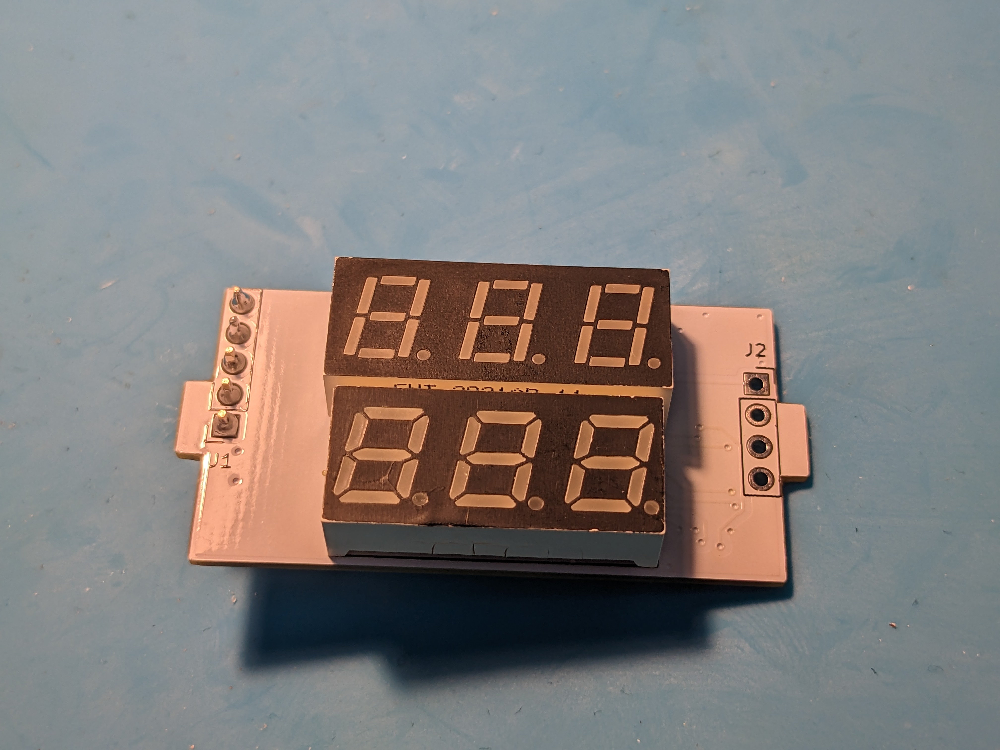
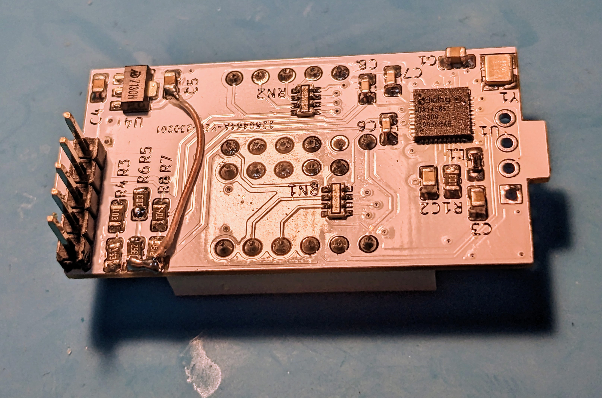

# Voltmeter for the power supply
Simple voltmeter on the DA14858 microcontroller

## Short description
The three channels ADC are used to measure voltage, current and the potentiometer value (that changed the current limit). The voltage and current are displayed if the potentiometer value isn't changing. If the potentiomter values is changed, the current limit value is displayed instead of the current.

Some of the changes on the PCB should be added because I needed to measure nagative voltages for my power supply.
